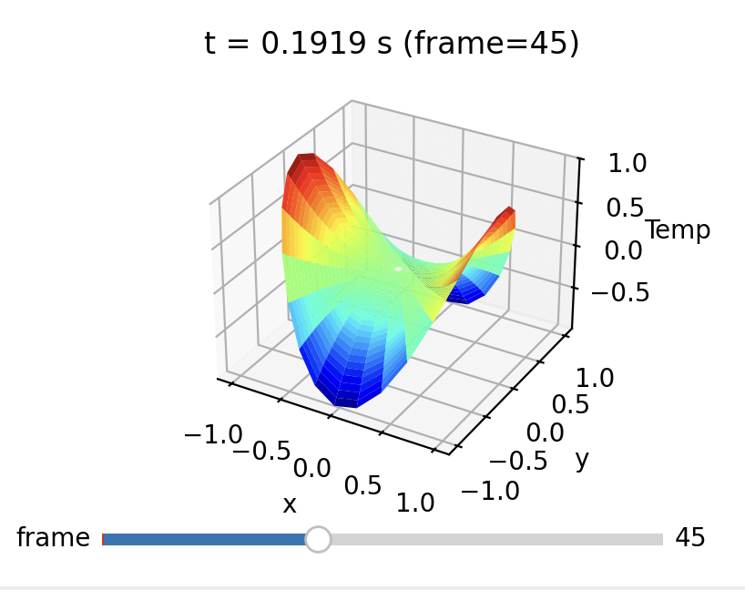
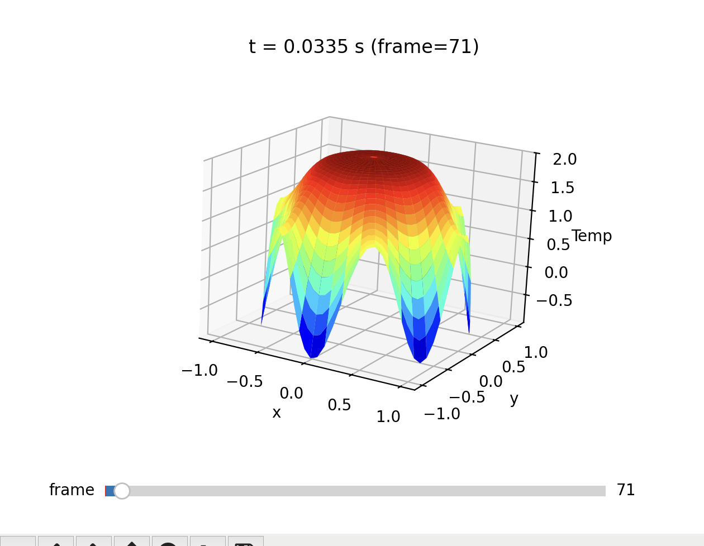
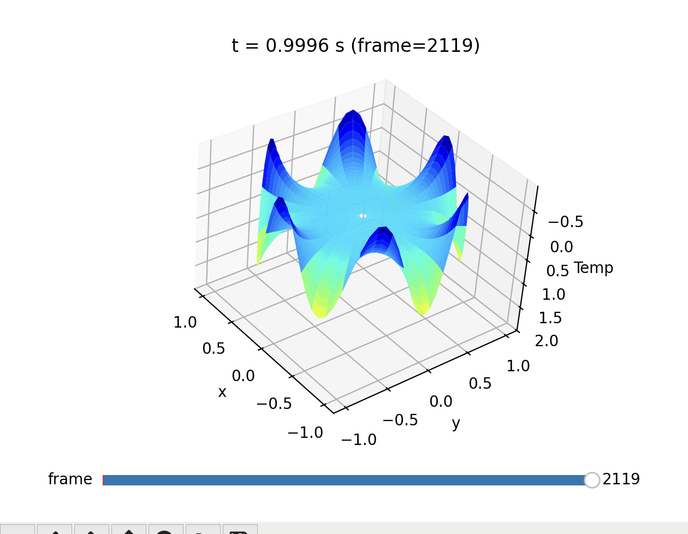
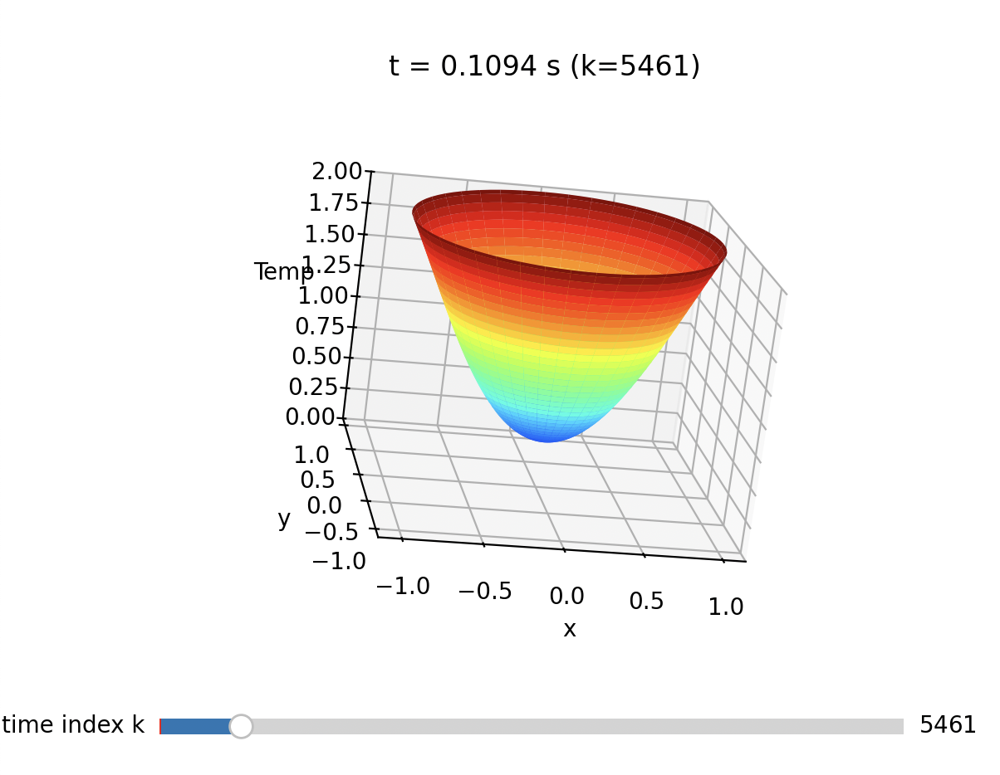

# Heat Diffusion and Geodesics
We're modeling heat diffusion and investigating curvature. This process began with simple simulations of heat diffusion on a 1D rod, and then a 2D surface. Then we messed with different boundary conditions, and transitioned to simulations in polar coordinates using the polar laplacian.

Our long-term goal is to model curvature flow on Riemann surfaces with conical singularities, and study the conditions for uniform curvature as a function of the cone angle.

### Installation
To run the simulations, you'll need to install `python`, and run
```powershell
pip3 install numpy
```
```powershell
pip3 install matplotlib
```
to install the necessary stack.

## `heat_simulations`
### `heat_simulations/first_passes`
In `first_passes`, you'll find the first simulations we created, like the initial 1D and 2D models, as well as experiments with more interesting boundary conditions. With `bounds_time_stack` we made our first attempt at storing all values and plotting all at once.

### `heat_simulations/polar`
In `polar`, you'll find our two directories:
### 2D:
In the `polar/2D` directory, we have the `conformal_cone_2D.py` and the `polar_2d.py` modules. 
`conformal_cone.py` is a simulation of curvature by a non-standard metric (Arya if you could help me out the terminology here). Notice that the `sim_in_polar()` function takes default parameters for `a` (the diffusivity constant), `t` (the time interval over which we simulate), as well as the number of radial and angular samples. At the bottom of the file, you can tweak the parameters as you wish. Run the file to see the simulation. Here is an example: 


`polar_2d.py` is a simulation of classical heat flow, done in polar coordinates. You can similarly adjust the paramters as you wish. Here is a cool example from at two different time points: 



### symmetric:
In the `polar/symmetric` folder are our first simulations in polar coordinates, which use the laplacian contructed to be radially symmetric, so we drop the angular derivative. Here's an example of the one simulating curvature over a cone (Arya please help with terminology!! haha): 

## `geodesics`
In the `geodesics` directory, you can see some attempts at modeling the trajectory of a geodesic near a cone structure. The animations are rudimentary (very ugly).


## Log
Updated runtime around 4x speed increase with Arya's slice method replacing the nested loops. Added angular derivative to conformal cone, used a +2 to avoid log(0) errors.