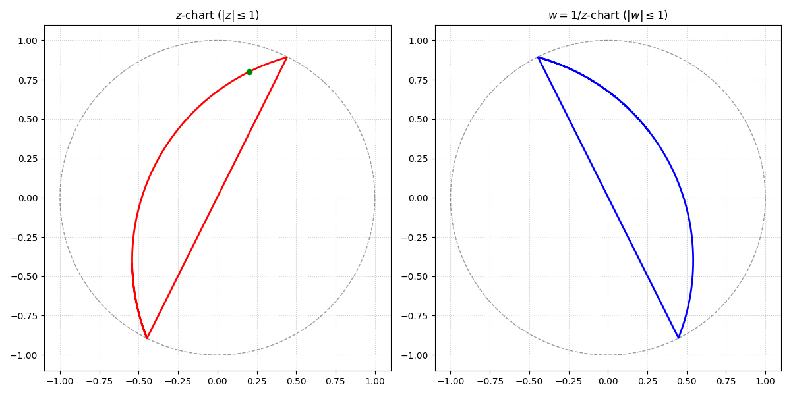

# Fubini-Study Metric

We have the `geodesic.py` file that uses the Fubini-Study metric. We start with a point in a disk. Then, we use the Fubini-Study metric to compute the geodesic. As the geodesic goes outside the disk, we project it to the new disk w = 1/z. Then, we compute the geodesic in the new disk. We repeat this process until we have a geodesic that goes around the disk. Finally, we plot the geodesic.

Example usage:
```bash
python3 geodesic.py --point 0.5+0.2j --tangent 0.1+0.9j --output geodesic.png
```


